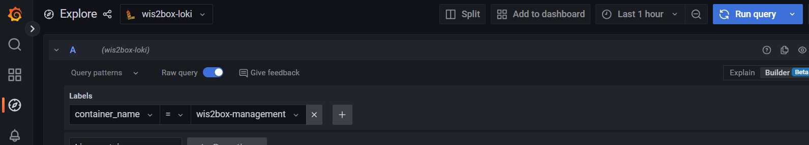

.. _troubleshooting:

Troubleshooting
===============

This page lists several commonly seen issues and how to address them.

wis2box-ctl.py status: one or more containers are restarting
------------------------------------------------------------

If you see that the wis2box-services are restarting and/or unhealthy when executing the command ``python3 wis2box-ctl.py status``, please check the logs of the services to identify the issue. 

You can use the 'Explore'-option in Grafana running on port 3000 of your instance to view the logs of the wis2box-services.

Open a browser and navigate to ``http://<your-instance-ip>:3000`` and select 'Explore' from the menu on the left.
Select 'wis2box-loki' as the datasource and use label=container_name as illustrated in the image below:

Select the container_name for the service you want to inspect, click on the 'Run query'-button and scroll down to view the logs.

No station on map in wis2box-ui
-------------------------------

The stations displayed in the wis2box-ui per dataset are defined by the topic associated with the station.

To associate a station with a topic, you can edit the station metadata using the station editor in wis2box-webapp or you can use the command ``wis2box metadata station add-topic`` to add a topic to a station.

For example, to add the topic ``origin/a/wis2/my-centre-id/data/core/weather/surface-based-observations/synop`` to the station with the WIGOS station identifier ``0-20000-0-12345``, run the following command:

.. code-block:: bash

   python3 wis2box-ctl.py login
   wis2box metadata station add-topic --wsi 0-20000-0-12345 origin/a/wis2/my-centre-id/data/core/weather/surface-based-observations/synop
	
To associated all stations defined in your station metadata with the same topic, you can use the command ``wis2box metadata station add-topic`` without specifying a station identifier:

.. code-block:: bash

   python3 wis2box-ctl.py login
   wis2box metadata station add-topic origin/a/wis2/my-centre-id/data/core/weather/surface-based-observations/synop

Topic Hierarchy validation error: Unknown file type
---------------------------------------------------

Check the ``wis2box.data_mappings`` section in your discovery metadata to adjust the file extension expected by the plugins processing your dataset.

If you are ingesting files with extension .bin:

.. code-block:: bash

        plugins:
            bin:
                - plugin: wis2box.data.bufr4.ObservationDataBUFR
                  notify: true
                  buckets:
                    - ${WIS2BOX_STORAGE_INCOMING}
                  file-pattern: '*'

If you are ingesting files with extension ``.b``:

.. code-block:: bash

        plugins:
            b:
                - plugin: wis2box.data.bufr4.ObservationDataBUFR
                  notify: true
                  buckets:
                    - ${WIS2BOX_STORAGE_INCOMING}
                  file-pattern: '*'

The Access Key Id you provided does not exist in our records
------------------------------------------------------------

If you see this error when uploading data to the wis2box-incoming storage, you have provided the wrong username and/or password to access MinIO.
Check the values for ``WIS2BOX_STORAGE_USERNAME`` and ``WIS2BOX_STORAGE_PASSWORD`` set in the ``wis2box.env`` file.

Topic Hierarchy validation error: No plugins for ... in data mappings
---------------------------------------------------------------------

A file arrived a folder for which no matching dataset was defined in the data mappings.

For dataset ``foo.bar``, store your file in the path ``/foo/bar/``.

This requires either updating the data mappings in your discovery metadata or changing the target folder under which the file is received.

ERROR - Failed to publish, wsi: ..., tsi: XXXXX
-----------------------------------------------

Data arrived for a station that is not present in the station metadata cache. 

To add missing stations, use the station-editor in wis2box-webapp (from wis2box-1.0b5) or update the file ``metadata/station/station_list.csv`` in the wis2box data directory and run the command:

.. code-block:: bash

   python3 wis2box-ctl.py login
   wis2box metadata station publish-collection

Error: no such container: wis2box-management
--------------------------------------------

If the wis2box-management container is not running, the ``login`` command will fail.
The wis2box-management container depends on other services being available before it can successfully started.

Please check all services are Running using the following command:

.. code-block:: bash

    python3 wis2box-ctl.py status

Possible issues are:

- The host ran out of diskspace, check the output of ``df -h`` and ensure there is sufficient space available
- The directory defined by ``WIS2BOX_HOST_DATADIR`` does not contain the file ``metadata/station/station_list.csv`` or the file is invalid
- ``WIS2BOX_STORAGE_PASSWORD`` is too short, MinIO will fail to start if you specify a ``WIS2BOX_STORAGE_PASSWORD`` of less than 8 characters

wis2box-ui is empty
-------------------

If when you access the wis2box UI you see the interface but no datasets are visible; check the ``WIS2BOX_URL`` and ``WIS2BOX_API_URL`` are set correctly.

Please note that after changing the ``WIS2BOX_URL`` and ``WIS2BOX_API_URL``, you will have to restart wis2box:

.. code-block:: bash

  python3 wis2box-ctl.py stop
  python3 wis2box-ctl.py start

..and then repeat the commands for adding your dataset and publishing your metadata, to ensure the URLs are updated in the records accordingly:

.. code-block:: bash

  python3 wis2box-ctl.py login
  wis2box data add-collection /data/wis2box/metadata/discovery/metadata-synop.yml
  wis2box metadata discovery publish /data/wis2box/metadata/discovery/metadata-synop.yml
