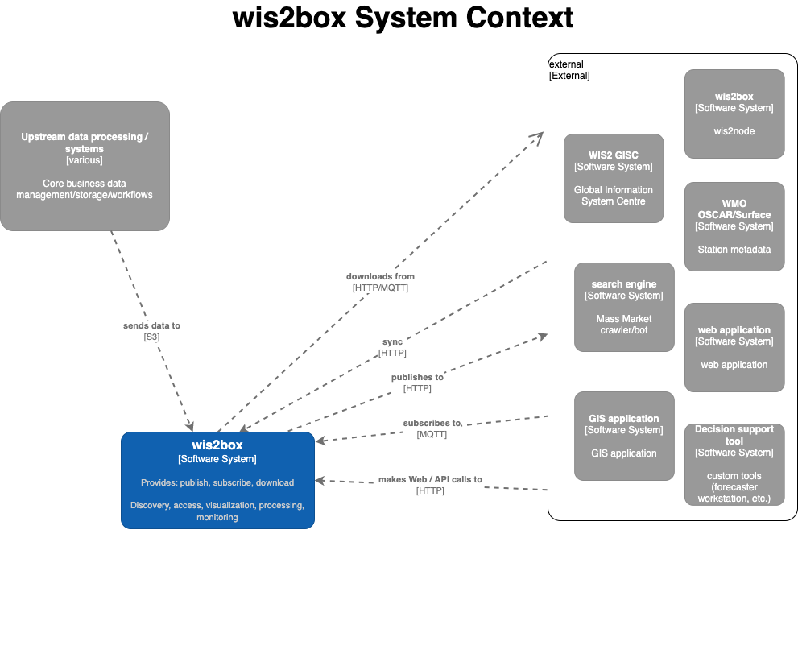
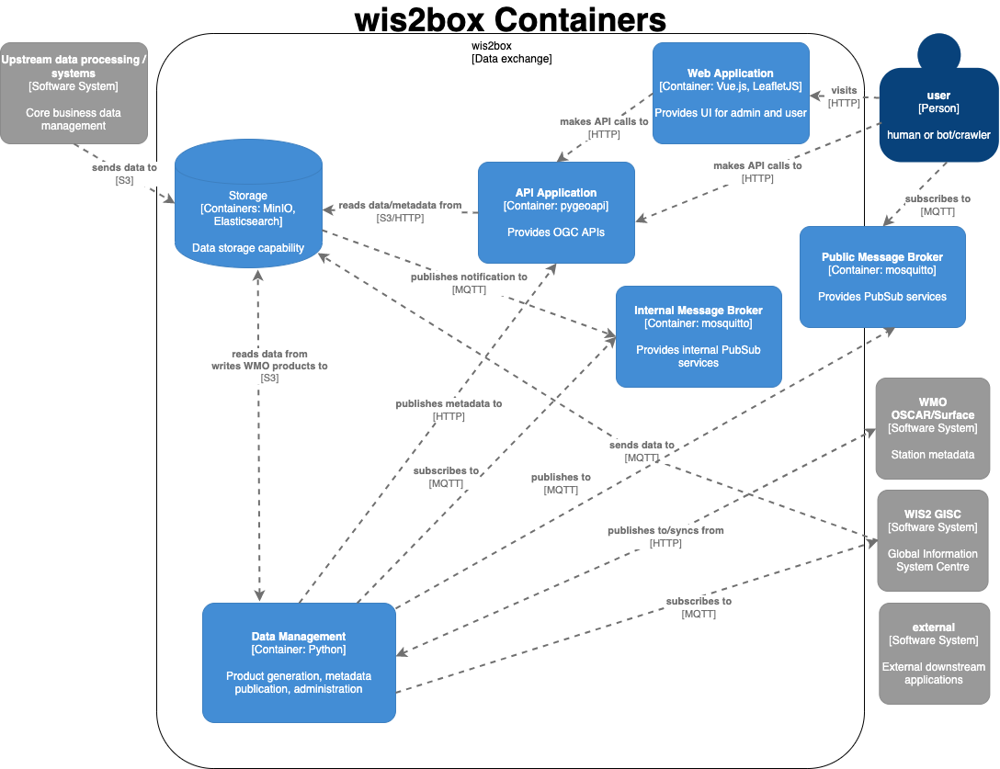

.. _how-wis2box-works:

How wis2box works
==================

wis2box is implemented in the spirit of the `Twelve-Factor App methodology`_.

wis2box is a `Docker`_ and `Python`_-based platform with the capabilities
for centres to integrate their data holdings and publish them to
the WMO Information System with a plug and play capability supporting
data publishing, discovery and access.

High level system context
--------------------------

The following diagram provides a high level overview of the main functions
of wis2box:

Core wis2box functionality includes the ability to:

* integrate your existing data processing pipeline
* cache station metadata from the `OSCAR/Surface`_ station metadata management
  tool
* process and transform your weather/climate/water data into official WMO data formats
* create and publish discovery metadata of your datasets
* provide your data via OGC and PubSub standards mechanisms to your data, enabling
  easy access for web applications, desktop GIS tools, mobile applications
* connect your wis2box to the WIS 2.0 network
* make your data and services available to market search engines
* subscribe to and download weather/climate/water data from the WIS 2.0 network

Docker Compose
--------------

wis2box is built as `Docker Compose`_ application, allowing for easy install and container
management.

Container workflow
------------------

Let's dive a little deeper. The following diagram provides a view of all
wis2box containers:

Container functionality can be described as follows:

* **Data Consumer**: the data entry point of wis2box. Data pipelines and
  workflow begins here
* **Data Management**: the epicentre of wis2box. Provides core wis2box
  administration and data/workflow/publising utilities
* **Storage**: core data persistence
* **API Application**: OGC APIs providing geospatial web services
* **Web Application**: user interface

Technology
----------

wis2box is built on free and open source (FOSS) technology.

.. csv-table::
   :header: Container, Function, Technology, Standards
   :align: left

   Data Consumer,PubSub,`mosquitto`_, MQTT
   Data Management,data processing and publishing,`pygeometa`_ `pyoscar`_,:abbr:`WCMP (WMO Core Metadata Profile)` :abbr:`WMDR (WIGOS Metadata Record)`
   API Application,data discovery and access,`pygeoapi`_ `Elasticsearch`_,OGC API
   Web Application,data discovery and visualization,`Vue.js`_ `Leaflet`_,OGC API

.. _`Twelve-Factor App methodology`: https://12factor.net
.. _`Docker`: https://www.docker.com
.. _`Python`: https://www.python.org
.. _`OSCAR/Surface`: https://oscar.wmo.int/surface
.. _`mosquitto`: https://mosquitto.org
.. _`pygeometa`: https://geopython.github.io/pygeometa
.. _`pyoscar`: https://github.com/wmo-cop/pyoscar
.. _`pygeoapi`: https://pygeoapi.io
.. _`Elasticsearch`: https://www.elastic.co/elasticsearch
.. _`Vue.js`: https://vuejs.org
.. _`Leaflet`: https://leafletjs.com
.. _`Docker Compose`: https://docs.docker.com/compose
