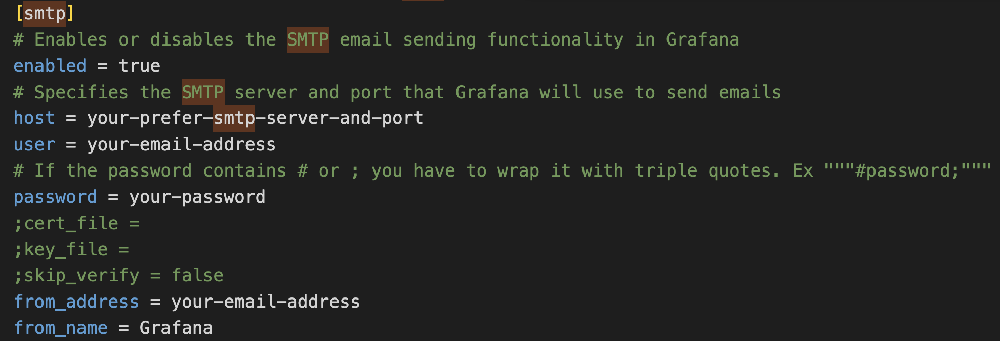
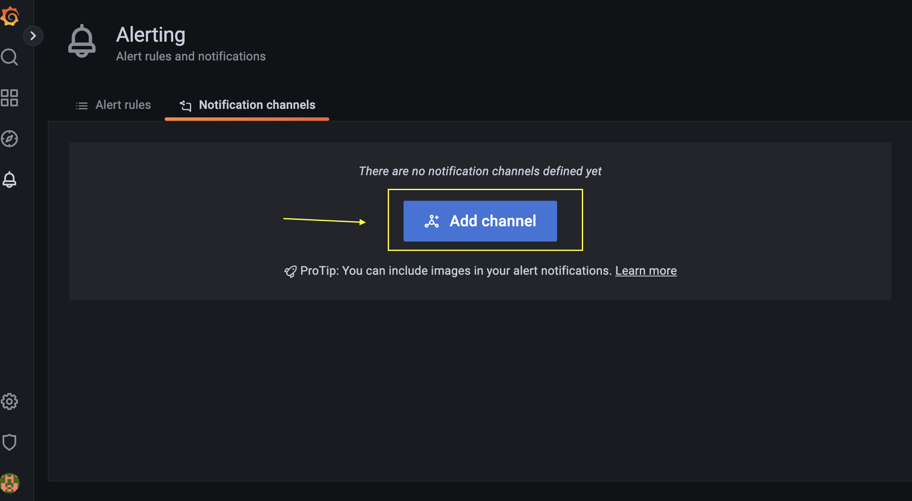
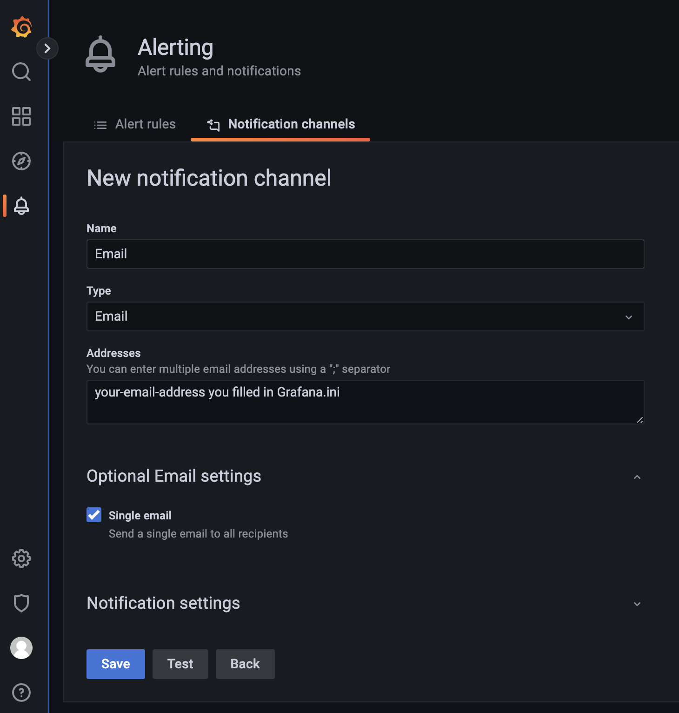
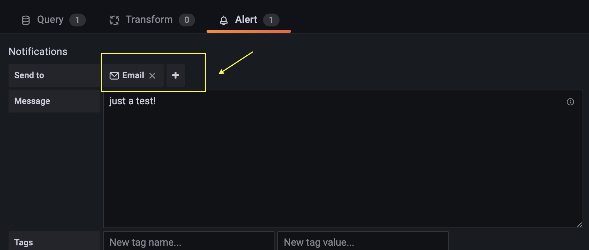
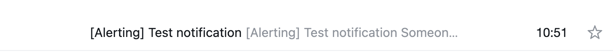

.. _alerts:

Alerts
======

Receiving alerts by email
^^^^^^^^^^^^^^^^^^^^^^^^^

This guide will walk you through the steps to configure Grafana to send email notifications when an alert is triggered on your dashboard. This process involves modifying configuration files and setting up an SMTP server to handle the outgoing emails.

Copy the ``grafana.ini`` file from docker container
---------------------------------------------------

First, you need to extract the ``grafana.ini`` file from your Grafana Docker container to your local system. For example:

.. code-block:: bash

    docker cp grafana:/etc/grafana/grafana.ini /your-local-directory
    
This command copies the ``grafana.ini`` from the Docker container to your local machine for editing.

Modify the ``grafana.ini`` file
-------------------------------

Open the ``grafana.ini`` file you just copied in a text editor and locate the [smtp] section. You will need to enable SMTP and configure it to use your email provider's SMTP server. Here’s how you can configure it for an email account:

.. note::

   The password used in the ``grafana.ini`` SMTP configuration is not your regular email account password. 
   Detailed descriptions are provided at the bottom of this page.

Mount ``grafana.ini`` to the grafana container
----------------------------------------------

You now need to ensure that your modified ``grafana.ini`` is used by Grafana inside the Docker container. To do this, update the docker-compose-monitoring.yml file to mount the local ``grafana.ini`` file into the container:

.. image:: ../../_static/mount-grafana.ini.png
   :width: 800px
   :alt: mount grafana
   :align: center
   
This line tells Docker to use the local version of ``grafana.ini`` when starting the Grafana container.

Restart wis2box to applying changes
-----------------------------------

For the changes to take effect, restart your wis2box environment:

.. code-block:: bash

    python3 wis2box-ctl.py restart

This command stops and then restarts your containers, ensuring that the new configuration is loaded.

Setting up the notification channel in grafana
----------------------------------------------

Log in to Grafana with your admin credentials:

* Navigate to Alerting -> Notification channels.

* Click "Add channel" and choose email as the notification type.

Enter your email address in the appropriate field and save the notification channel.

Configuring alerts in your grafana dashboard
--------------------------------------------

Now, set up alerts within your grafana dashboard:

* Open the dashboard where you want to add an alert.

* Go to the panel where you want to add the alert and click on the "Alert" tab.

* Set your alert conditions, then under "Notifications", select the email notification channel you configured earlier.

* Click "Apply" and save the dashboard.

* Export and save the updated dashboard JSON to ensure the changes are persistent.

Final step: testing the setup
-----------------------------

After setting everything up, trigger an alert in your grafana dashboard to test if the email notifications are working. You should receive an email when the alert conditions are met.

.. note::

    The most challenging part of this setup is obtaining the correct SMTP password. Here’s how to do it for different email providers:

    For gmail:

    * Enable Less Secure Apps: If you don't use 2FA, enable "Less secure app access" in your Google account settings.
    * Generate an App Password: If you use 2FA:
    * Go to your Google Account -> Security -> App passwords.
    * Generate a new app password for "Mail".
    * Use this app password in the ``grafana.ini`` password field.

    For WMO email or other providers:

    * Check Provider Documentation: Different providers have different methods for generating app passwords or enabling SMTP.
    * Contact IT Support: If you're using a corporate email (like WMO email), contact your IT department to get the correct SMTP settings and password.

