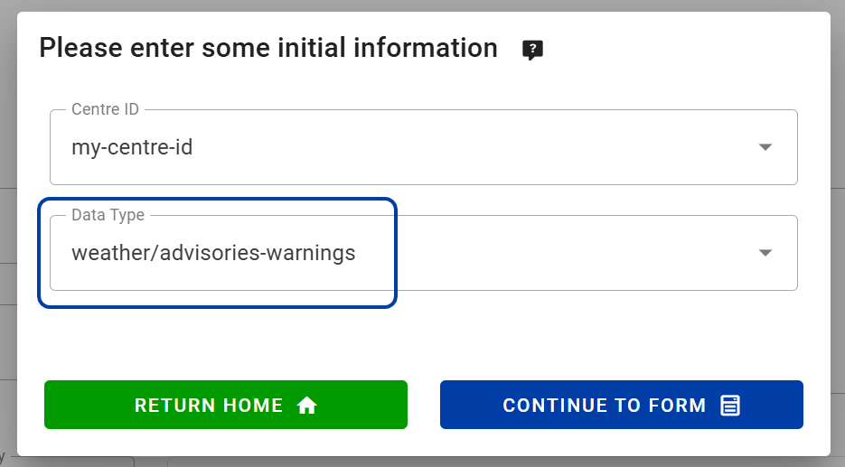
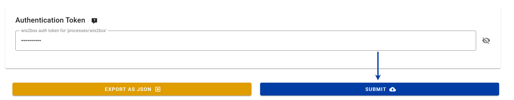
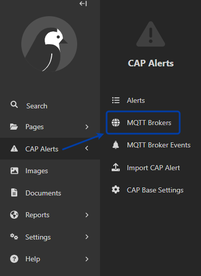
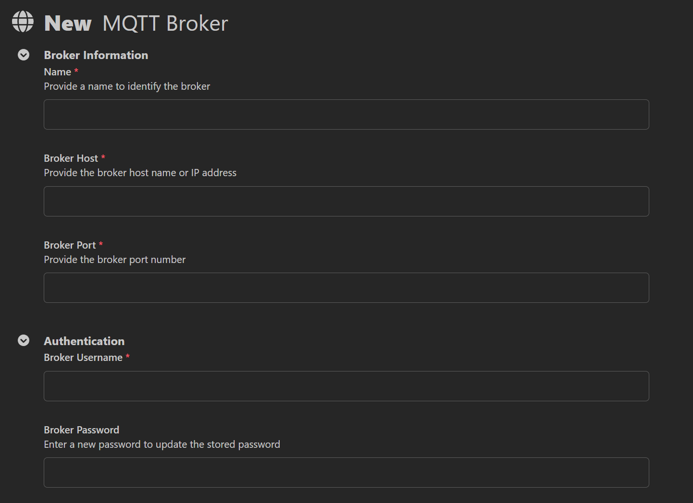
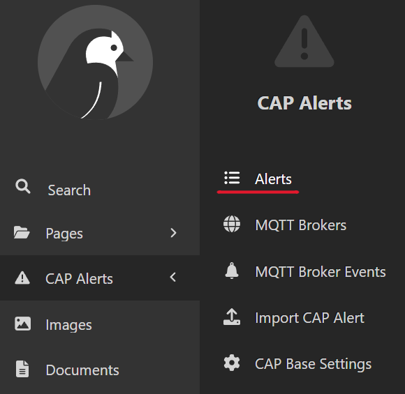
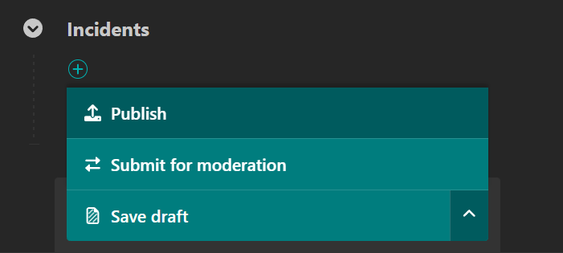
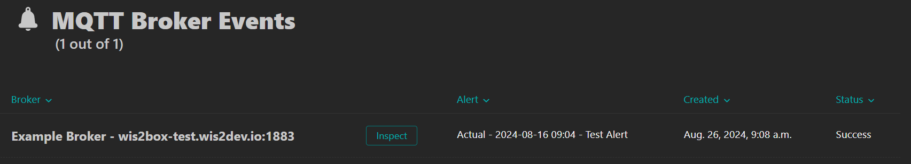
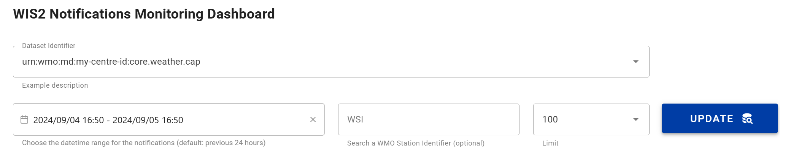
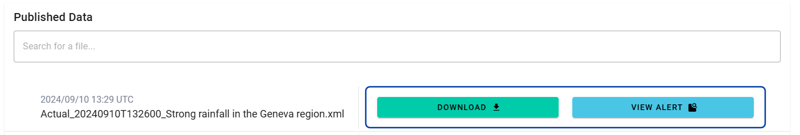
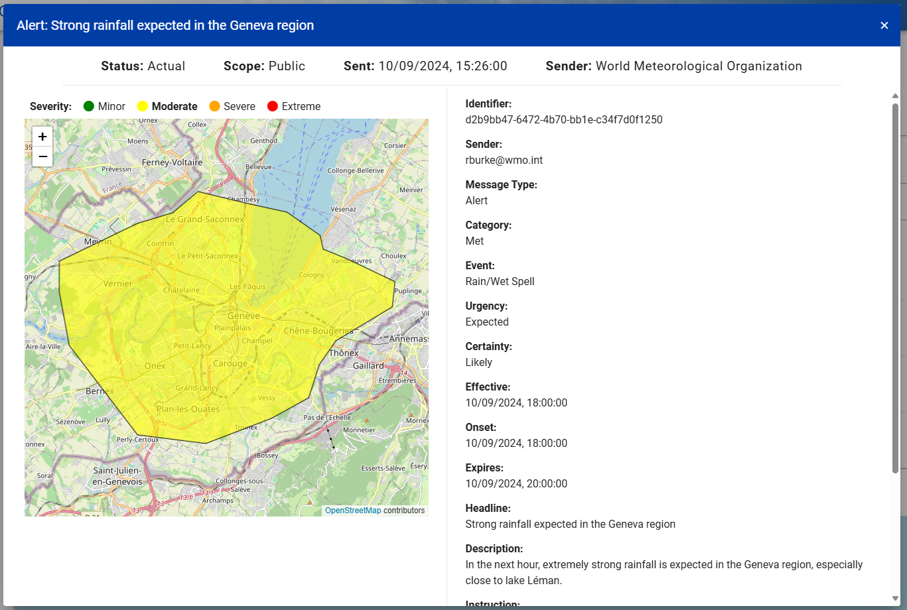

.. _cap-alerts:

Publishing CAP Alerts to a wis2box
==================================

Overview
--------
The Common Alerting Protocol (CAP) is a simple but general format for exchanging all-hazard emergency alerts and public warnings over all kinds of networks, see the full specification `here <https://docs.oasis-open.org/emergency/cap/v1.2/CAP-v1.2.html>`_.

This section provides guidance one how one can use the `CAP Composer <https://github.com/wmo-raf/cap-composer>`_ to automate the publishing of CAP alerts to a wis2box.

Requirements
------------
In addition to a running wis2box, you will need to install, configure, and run the CAP Composer.

.. note::
   For information on how to do this, please consult the `CAP Composer documentation <https://nmhs-cms.readthedocs.io/en/stable/_docs/Manage-CAP-Alerts.html>`_.

Process Outline
---------------
For automated publishing of CAP alerts to a wis2box, we will need to perform the following steps:

1. *Dataset Creation:* Configure the dataset in the wis2box to store the CAP alerts.
2. *MQTT Configuration:* Configure your wis2box broker details in the CAP Composer.

Dataset Creation
----------------
Firstly, there must be a dataset in the wis2box for the CAP alerts to be stored. To create a dataset, simply navigate to the 'Dataset Editor' page in the wis2box-webapp, available on your host at `http://<your-public-ip>/wis2box-webapp`.

.. note::
   For more information on how to create a dataset, please see the :ref:`adding-datasets` section of the wis2box setup guide.

When creating a new dataset for CAP alerts, ensure that the **weather/advisories-warnings** template is selected:

Enter the relevant missing information and create the dataset using your processes/wis2box token.

Now the dataset is created, note down the dataset ID, as it will be required in the next step.

MQTT Configuration
------------------
Begin by logging in to the CAP Composer.

.. note::
   We will assume that you have the necessary admin rights to configure the CAP Composer. If you do not, please contact your CAP focal point.

Navigate to 'CAP Alerts', then 'MQTT Brokers' in the left-hand menu.

Click on the 'Add MQTT Broker' button in the top-right corner to add a new broker. You should see the following form:

Here, we should fill the following fields:

- **Name**: A name for the broker.
- **Host**: The ``WIS2BOX_BROKER_HOST`` environment variable from the wis2box configuration.
- **Port**: The ``WIS2BOX_BROKER_PORT`` environment variable from the wis2box configuration.
- **Username**: The ``WIS2BOX_BROKER_USERNAME`` environment variable from the wis2box configuration.
- **Password**: The ``WIS2BOX_BROKER_PASSWORD`` environment variable from the wis2box configuration.
- **WIS2 Node**: Confirmation that the MQTT broker is a WIS2 node (defaults to True).
- **Dataset ID**: The dataset ID of the dataset created in the previous step.

Once you have filled in the form, click the *Save* button to save the broker configuration.

You will be redirected back to the 'MQTT Brokers' page, where you should see the newly added broker.

.. image:: ../_static/cap/mqtt_broker_list.png
   :alt: MQTT Broker List
   :width: 600

Publishing an Alert
-------------------
Let's begin by creating a CAP alert. This can be done by navigating to 'CAP Alerts', then 'Alerts' in the left-hand menu, and clicking the *Add Alert* button in the top-right corner.

.. note::
   For more information on how to create a CAP alert, please see the `CAP Composer documentation on creating alerts <https://nmhs-cms.readthedocs.io/en/stable/_docs/Manage-CAP-Alerts.html#creating-a-cap-alert>`_.

Once the alert is finished, if you are a CAP approver you should see a *Publish* button at the bottom:

On clicking the *Publish* button, the alert XML file will automatically be created, signed, and published to your wis2box.

.. note::
   If you are a CAP composer, you will only be able to submit the alert for moderation. It is then the responsibility of the CAP approver to approve and publish the alert.

You can view the status of the published alert in the 'CAP Alerts', then 'MQTT Broker Events' section of the CAP Composer.

Additional diagnostic information can be found by clicking the *Inspect* button.

Verifying Receipt of a Published Alert and Viewing the Alert
------------------------------------------------------------
We can verify that the alert has been successfully published to the wis2box by monitoring the dataset in the wis2box-webapp.

Navigate to the 'Monitoring' page in the wis2box-webapp, and select the dataset that you created in the previous steps.

.. note::
   If you do not see the dataset, ensure that the datetime range selected includes the time of the alert publication.

Provided the publication was successful, you will see a bar in the 'Notifications' section. If you scroll down to the 'Published Data' section, the signed and verified CAP alert should appear in the table to download and view.

On clicking the *View Alert* button, you should see a visualization of the CAP alert you created earlier.

Congratulations! You have successfully published a CAP alert to a wis2box using the CAP Composer.
