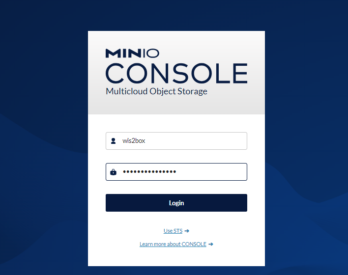
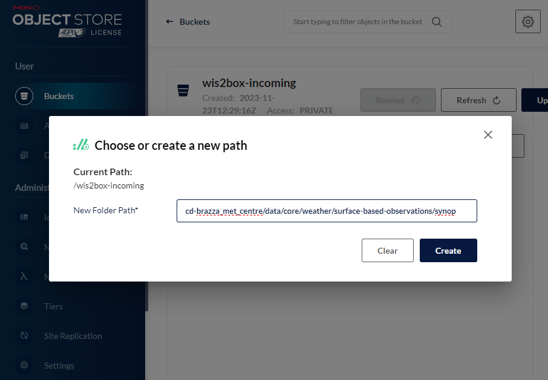
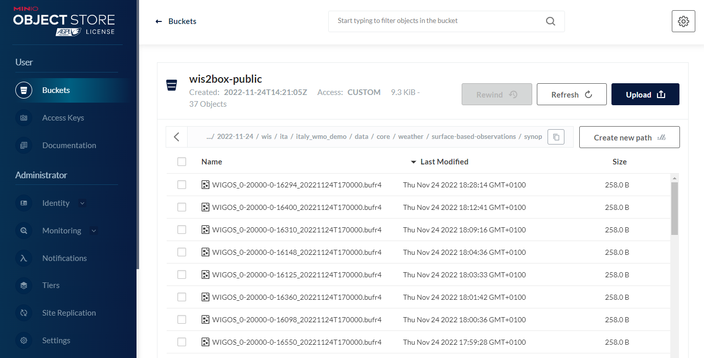
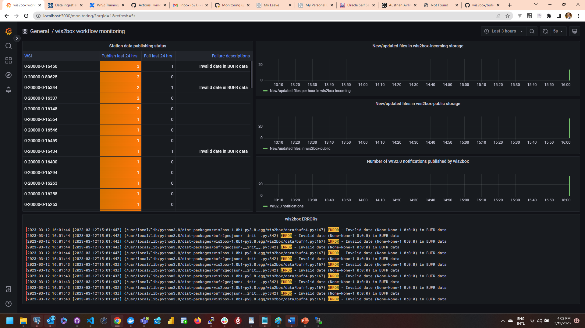
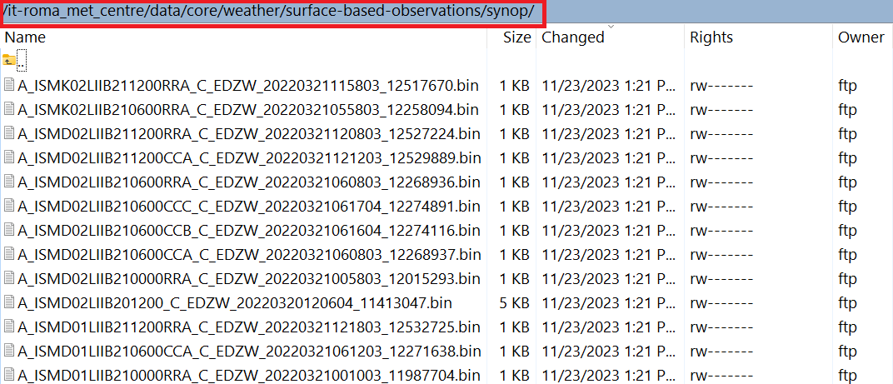

.. _data-ingest:

Data ingest setup
=================

The runtime component of wis2box is data ingestion. This is an event driven workflow driven by S3 notifications from uploading data to wis2box storage.

The wis2box storage is provided using a `MinIO`_ container that provides S3-compatible object storage.

Any file received in the ``wis2box-incoming`` storage bucket will trigger an action to process the file. 
What action to take is determined by the ``data-mappings.yml`` you've setup in the previous section.

MinIO user interface
--------------------

To access the MinIO user interface, visit ``http://localhost:9001`` in your web browser.

You can login with your ``WIS2BOX_STORAGE_USERNAME`` and ``WIS2BOX_STORAGE_PASSWORD``:

To test the data ingest, add a sample file for your observations in the ``wis2box-incoming`` storage bucket.

Select 'browse' on the ``wis2box-incoming`` bucket and select 'Choose or create a new path' to define a new folder path:

.. note::
    The folder in which the file is placed defines the dataset for the data you are sharing.  For example, for dataset ``foo.bar``, store your file in the path ``/foo/bar/``. 
    
    The path is also used to define the topic hierarchy for your data (see `WIS2 topic hierarchy`_). The first 3 levels of the WIS2 topic hierarchy ``origin/a/wis2`` are automatically included by wis2box when publishing data notification messages.

    * The error message ``Topic Hierarchy validation error: No plugins for minio:9000/wis2box-incoming/... in data mappings`` indicates you stored a file in a folder for which no matching dataset was defined in your ``data-mappings.yml``.

After uploading a file to ``wis2box-incoming`` storage bucket, you can browse the content in the ``wis2box-public`` bucket.  If the data ingest was successful, new data will appear as follows:

If no data appears in the ``wis2box-public`` storage bucket, you can inspect the logs from the command line:

.. code-block:: bash

   python3 wis2box-ctl.py logs wis2box

Or by visiting the local Grafana instance running at ``http://localhost:3000``

wis2box workflow monitoring
---------------------------

The Grafana homepage shows an overview with the number of files received, new files produced and WIS2 notifications published.

The `Station data publishing status` panel (on the left side) shows an overview of notifications and failures per configured station.

The `wis2box ERRORs` panel (on the bottom) prints all ERROR messages reported by the wis2box-management container.

Once you have verified that the data ingest is working correctly you can prepare an automated workflow to send your data into wis2box.

Automating data ingestion
-------------------------

See below a Python example to upload data using the MinIO package:

.. code-block:: python

    import glob
    import sys

    from minio import Minio

    filepath = '/home/wis2box-user/local-data/mydata.bin'
    minio_path = '/ita/italy_wmo_demo/data/core/weather/surface-based-observations/synop/'

    endpoint = 'http://localhost:9000'
    WIS2BOX_STORAGE_USERNAME = '<your-wis2box-storage-username>'
    WIS2BOX_STORAGE_PASSWORD = '<your-wis2box-storage-password>'

    client = Minio(
        endpoint=endpoint,
        access_key=WIS2BOX_STORAGE_USERNAME,
        secret_key=WIS2BOX_STORAGE_PASSWORD,
        secure=is_secure=False)
    
    filename = filepath.split('/')[-1]
    client.fput_object('wis2box-incoming', minio_path+filename, filepath)

wis2box-ftp
-----------

You can add an additional service to allow your data to be accessible over FTP.

To use the ``docker-compose.wis2box-ftp.yml`` template included in wis2box, create a new file called ``ftp.env`` using any text editor, and add the following content:

.. code-block:: bash

    MYHOSTNAME=hostname.domain.tld

    FTP_USER=wis2box
    FTP_PASS=wis2box123
    FTP_HOST=${MYHOSTNAME}

    WIS2BOX_STORAGE_ENDPOINT=http://${MYHOSTNAME}:9000
    WIS2BOX_STORAGE_USER=minio
    WIS2BOX_STORAGE_PASSWORD=minio123

    LOGGING_LEVEL=INFO

and ensure ``MYHOSTNAME`` is set to **your** hostname (fully qualified domain name).

Then start the ``wis2box-ftp`` service with the following command:

.. code-block:: bash

    docker compose -f docker-compose.wis2box-ftp.yml --env-file ftp.env up -d

When using the wis2box-ftp service to ingest data, please note that the topic is determined by the directory structure in which the data arrives.

For example to correctly ingest data on the topic ``ita.roma_met_centre.data.core.weather.surface-based-observations.synop`` you need to copy the data into the directory ``/ita/roma_met_centre/data/core/weather/surface-based-observations/synop`` on the FTP server:

See the GitHub repository `wis2box-ftp`_ for more information on this service.

wis2box-data-subscriber
-----------------------

You can add an additional service on the host running your wis2box instance to allow data to be ingested by publishing an MQTT message to the wis2box broker.

This service subscribes to the topic ``data-incoming/#`` on the wis2box broker and parses the content of received messages and publishes the result in the ``wis2box-incoming`` bucket.

To start the ``wis2box-data-subscriber``, add the following additional variables to ``dev.env``:

.. code-block:: bash

    COUNTRY_ID=zmb  # set country_id used in wis2-topic-hierarchy
    CENTRE_ID=zmb_met_centre  # set centre_id for wis2-topic-hierarchy

These variables determine the destination path in the ``wis2box-incoming`` bucket:

``{COUNTRY_ID}/{CENTRE_ID}/data/core/weather/surface-based-observations/synop/``

You then you can activate the optional 'wis2box-data-subscriber' service as follows:

.. code-block:: bash

    docker compose -f docker-compose.data-subscriber.yml --env-file dev.env up -d

See the GitHub `wis2box-data-subscriber`_ repository for more information on this service.

Next steps
----------

After you have successfully setup your data ingest process into the wis2box, you are ready to share your data with the global
WIS2 network by enabling external access to your public services.

Next: :ref:`public-services-setup`

.. _`MinIO`: https://min.io/docs/minio/container/index.html
.. _`wis2box-ftp`: https://github.com/wmo-im/wis2box-ftp
.. _`wis2box-data-subscriber`: https://github.com/wmo-im/wis2box-data-subscriber
.. _`WIS2 topic hierarchy`: https://github.com/wmo-im/wis2-topic-hierarchy
