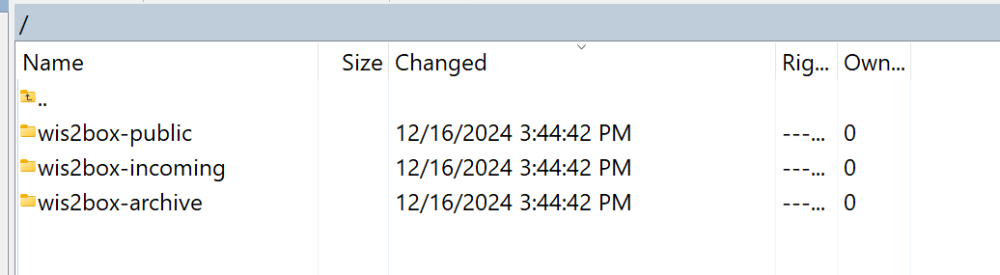

.. _data-ingest:

Data ingest setup
=================

The runtime component of wis2box is data ingestion. This is an event driven workflow driven by S3 notifications from uploading data to wis2box storage.

The wis2box storage is provided using a `MinIO`_ container that provides S3-compatible object storage.

Any file received in the ``wis2box-incoming`` storage bucket will trigger an action to process the file. 
What action to take is determined by the data mappings that were setup in the previous section.

wis2box-webapp
--------------

The wis2box-webapp is a web application that includes the following forms for data validation and ingestion:

* user interface to ingest `FM-12 SYNOP data <https://library.wmo.int/idviewer/35713/33>`_
* user interface to ingest CSV data using the :ref:`AWS template<aws-template>`

The wis2box-webapp is available on your host at `http://<your-public-ip>/wis2box-webapp`.

Interactive data ingestion requires an execution token, which can be generated using the ``wis2box auth add-token`` command inside the wis2box-management container:

.. code-block:: bash

    python3 wis2box-ctl.py login
    wis2box auth add-token --path processes/wis2box

.. note::

   Be sure to record the token value, as it will not be shown again. If you lose the token, you can generate a new one.

data mappings plugins
---------------------

The plugins you have configured for your dataset mappings will determine the actions taken when data is received in the MinIO storage bucket.

The wis2box provides 3 types of built-in plugins to publish data in BUFR format:

* `bufr2bufr` : the input is received in BUFR format and split by subset, where each subset is published as a separate bufr message
* `synop2bufr` : the input is received in `FM-12 SYNOP format <https://library.wmo.int/idviewer/35713/33>`_ and converted to BUFR format. The year and month are extracted from the file pattern
* `csv2bufr` : the input is received in CSV format and converted to BUFR format, a mapping template is used to convert the CSV columns to BUFR encoded values. Custom mapping templates need to be placed in the ``$WIS2BOX_HOST_DATADIR/mappings`` directory. See :ref:`csv2bufr-templates` for examples of mapping templates

To publish data for other data formats you can use the 'Universal' plugin, which will pass through the data without any conversion.
Please note that you will need to ensure that the date timestamp can be extracted from the file pattern when using this plugin.

.. _aws-template:

The AWS template in csv2bufr plugin
-----------------------------------

When using the csv2bufr plugin, the columns are mapped to BUFR encoded values using a template as defined in the repository `csv2bufr-templates`_.

An example of a CSV file that can be ingested using the 'AWS' mappings template can be downloaded here :download:`AWS-example <../_static/aws-example.csv>`

The CSV columns description of the AWS template can be downloaded here :download:`AWS-reference <../_static/aws-minimal.csv>`

MinIO user interface
--------------------

To access the MinIO user interface, visit ``http://<your-host-ip>:9001`` in your web browser.

You can login with your ``WIS2BOX_STORAGE_USERNAME`` and ``WIS2BOX_STORAGE_PASSWORD``:

.. image:: ../_static/minio-login-screen2.png
    :width: 400
    :alt: MinIO login screen

.. note::

   The ``WIS2BOX_STORAGE_USERNAME`` and ``WIS2BOX_STORAGE_PASSWORD`` are defined in the ``wis2box.env`` file.

To test the data ingest, add a sample file for your observations in the ``wis2box-incoming`` storage bucket.

Select 'browse' on the ``wis2box-incoming`` bucket and select 'Choose or create a new path' to define a new folder path:

.. image:: ../_static/minio-new-folder-path.png
    :width: 800
    :alt: MinIO new folder path

.. note::
    The folder in which the file is placed will be used to determine the dataset to which the file belongs.
    
    The wis2box-management container will match the path of the file to the dataset defined in the data mappings by checking it either contains the metadata identifier or the topic (excluding 'origin/a/wis2/').
    
    For example, using a filepath matching the metadata identifier:

    * Metadata identifier: ``urn:wmo:md:it-meteoam:surface-weather-observations.synop``
    * upload data in path containing: ``it-meteoam:surface-weather-observations.synop``

    For example using a filepath matching the topic hierarchy:
    
    * Topic Hierarchy: ``origin/a/wis2/cg-met/data/recommended/weather/surface-based-observations/synop``
    * upload data in the path containing: ``cg-met/data/recommended/weather/surface-based-observations/synop``

    The error message ``Path validation error: Could not match http://minio:9000/wis2box-incoming/... to dataset, ...`` indicates that a file was stored in a directory that could not be matched to a dataset.

After uploading a file to ``wis2box-incoming`` storage bucket, you can browse the content in the ``wis2box-public`` bucket.  If the data ingest was successful, new data will appear as follows:

.. image:: ../_static/minio-wis2box-public.png
    :width: 800
    :alt: MinIO wis2box-public storage bucket

If no data appears in the ``wis2box-public`` storage bucket, you can inspect the logs from the command line:

.. code-block:: bash

   python3 wis2box-ctl.py logs wis2box

Or by visiting the local Grafana instance running at ``http://<your-host-ip>:3000``

wis2box workflow monitoring
---------------------------

The Grafana homepage shows an overview with the number of files received, new files produced and WIS2 notifications published.

The `Station data publishing status` panel (on the left side) shows an overview of notifications and failures per configured station.

The `wis2box ERRORs` panel (on the bottom) prints all ERROR messages reported by the wis2box-management container.

.. image:: ../_static/grafana-homepage.png
    :width: 800
    :alt: wis2box workflow monitoring in Grafana

Once you have verified that the data ingest is working correctly you can prepare an automated workflow to send your data into wis2box.

Automating data ingestion
-------------------------

See below a Python example to upload data using the MinIO package:

.. code-block:: python

    import glob
    import sys

    from minio import Minio

    filepath = '/home/wis2box-user/local-data/mydata.bin'
    # path should match the metadata or the topic in the data mappings
    minio_path = 'urn:wmo:md:it-meteoam:surface-weather-observations'

    endpoint = 'http://localhost:9000'
    WIS2BOX_STORAGE_USERNAME = 'wis2box'
    WIS2BOX_STORAGE_PASSWORD = '<your-wis2box-storage-password>'

    client = Minio(
        endpoint=endpoint,
        access_key=WIS2BOX_STORAGE_USERNAME,
        secret_key=WIS2BOX_STORAGE_PASSWORD,
        secure=False)
    
    filename = filepath.split('/')[-1]
    client.fput_object('wis2box-incoming', minio_path+filename, filepath)

.. note::
    
    In the example the file ``mydata.bin`` in ingested from the directory ``/home/wis2box-user/local-data/`` on the host running wis2box.
    If you are running the script on the same host as wis2box, you can use the endpoint ``http://localhost:9000`` as in the example. 
    Otherwise, replace localhost with the IP address of the host running wis2box. 

.. note::

    The MinIO package is required for running the script above.
    
    To install the MinIO package, run the following command:

    .. code-block:: bash

        pip3 install minio
        
uploading data to MinIO over SFTP
---------------------------------

As of wis2box-RC1, you can also upload data to MinIO using SFTP.

By default the SFTP service is enabled on port 8022. You can connect to the SFTP service using the MinIO storage username and password.
You can use a client like WinSCP to connect to the SFTP service and you will see the bucket structure in the SFTP client as shown in the screenshot below:

To start trigger the wis2box data flow data needs to be uploaded to the ``wis2box-incoming`` bucket, in a directory that matches the dataset metadata identifier or the topic in the data mappings.

wis2box-data-subscriber
-----------------------

.. note::

   This service currently only works with Campbell scientific data loggers version CR1000X.

You can add an additional service on the host running your wis2box instance to allow data to be received over MQTT.

This service subscribes to the topic ``data-incoming/#`` on the wis2box broker and parses the content of received messages and publishes the result in the ``wis2box-incoming`` bucket.

To start the ``wis2box-data-subscriber``, add the following additional variables to ``wis2box.env``:

.. code-block:: bash

    CENTRE_ID=zm-zmb_met_centre  # set centre_id for wis2-topic-hierarchy

These variables determine the destination path in the ``wis2box-incoming`` bucket:

``{CENTRE_ID}/data/core/weather/surface-based-observations/synop/``

You then you can activate the optional 'wis2box-data-subscriber' service as follows:

.. code-block:: bash

    docker compose -f docker-compose.data-subscriber.yml --env-file wis2box.env up -d

See the GitHub `wis2box-data-subscriber`_ repository for more information on this service.

Next steps
----------

After you have successfully setup your data ingest process into the wis2box, you are ready to share your data with the global
WIS2 network by enabling external access to your public services.

Next: :ref:`public-services-setup`

.. _`MinIO`: https://min.io/docs/minio/container/index.html
.. _`wis2box-ftp`: https://github.com/wmo-im/wis2box-ftp
.. _`wis2box-data-subscriber`: https://github.com/wmo-im/wis2box-data-subscriber
.. _`WIS2 topic hierarchy`: https://github.com/wmo-im/wis2-topic-hierarchy
.. _`csv2bufr-templates`: https://github.com/wmo-im/csv2bufr-templates
