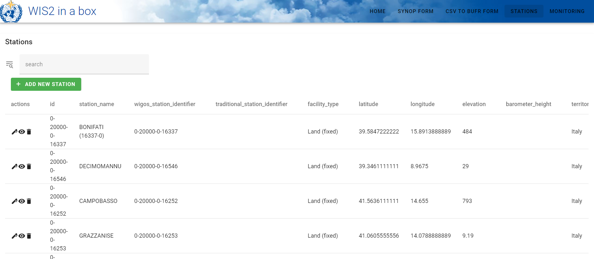

.. _setup:

Installation and configuration
==============================

This section summarizes the steps required to install a wis2box instance and setup your own datasets using initial configuration files 
provided by using the ``wis2box-create-config.py`` script.

Ensure you have Docker, Docker Compose and Python installed on your host, as detailed in :ref:`getting-started`.

Download
--------

Download the wis2box setup files from the `wis2box Releases`_ page.  Go to the latest release
and download the ``wis2box-setup-1.0b4.zip`` file from the Assets section.

.. code-block:: bash

   wget https://github.com/wmo-im/wis2box/releases/download/1.0b4/wis2box-setup-1.0b5.zip
   unzip wis2box-setup-1.0b5.zip
   cd wis2box-1.0b5

Create initial configuration files
----------------------------------

Run the following command to create the initial configuration files for your wis2box:

.. code-block:: bash

   python3 wis2box-create-config.py

.. note::

    The ``wis2box-create-config.py`` script will ask for a directory to store the configuration files. 
    Please provide the **absolute** path to the directory where you want to store the configuration files, for example ``/home/wis2box-user/wis2box-data``.
    This directory will be mapped to ``/data/wis2box`` **inside** the wis2box-management container.

   The script will also ask for the URL of your wis2box. Please provide the public URL of your wis2box, for example ``http://mywis2box.example.com``. 
   For testing purpose you can also provide the internal IP address you use to access the host, for example ``http://192.168.0.3`` and you change the URL in configuration files later.

   The script will propose to automatically create passwords for WIS2BOX_STORAGE_PASSWORD and WIS2BOX_BROKER_PASSWORD. 
   These passwords are for internal use only within the wis2box, and it is recommended to accept the randomly generated passwords.

   The script will ask for 3-letter ISO country code for your wis2box. Please provide the 3-letter ISO country code for your country, for example ``FRA``. 
   It will also ask for a center-id. Please provide a string that identifies your organization and does not use spaces or special characters, for example ``meteofrance``. 
   These fields will be automatically converted to lowercase.

   The remaining questions will be used in the creation the discovery metadata files for the ``synop`` and ``temp`` datasets.

Discovery metadata
------------------

Discovery metadata provides the data description needed for users to discover your data when searching the WIS2 Global Discovery Catalogue.

The discovery metadata is provided in the form of a YAML file.

If you used the ``python3 wis2box-create-config.py`` command to initialize your wis2box, you will find two initial the discovery metadata files in
the directory you specified for your configuration files, under the ``metadata/discovery/`` directory:
   
* ``metadata-synop.yml``: contains the discovery metadata for the ``synop`` dataset
* ``metadata-temp.yml``: contains the discovery metadata for the ``temp`` dataset

Please review the content of these files and edit them as needed.

You can also add additional discovery metadata files for any other datasets you wish to publish.

Starting wis2box
----------------

Once you have prepared the necessary configuration files as described above you are ready to start the wis2box.

Run the following command to start wis2box:

.. code-block:: bash

   python3 wis2box-ctl.py start

This might take a while the first time, as Docker images will be downloaded.

.. note::

   The ``wis2box-ctl.py`` program is used as a convenience utility around a set of Docker Compose commands.
   You can customize the ports exposed on your host by editing ``docker-compose.override.yml``.
   
.. note::

   If you get the error:

   ``docker.errors.DockerException: Error while fetching server API version: ('Connection aborted.', PermissionError(13, 'Permission denied'))``

   Please ensure your username is added to the docker group ``sudo usermod -aG docker <your-username>``.
   Logout and log back in so that your group membership is re-evaluated.

Once the command above is completed, check that all services are running (and healthy).

.. code-block:: bash

   python3 wis2box-ctl.py status

Which should display the following:

.. code-block:: bash

            Name                       Command                  State                           Ports
   -----------------------------------------------------------------------------------------------------------------------
   cadvisor                 /usr/bin/cadvisor -logtostderr   Up (healthy)   8080/tcp
   elasticsearch            /bin/tini -- /usr/local/bi ...   Up (healthy)   9200/tcp, 9300/tcp
   grafana                  /run.sh                          Up             0.0.0.0:3000->3000/tcp
   loki                     /usr/bin/loki -config.file ...   Up             3100/tcp
   mosquitto                /docker-entrypoint.sh /usr ...   Up             0.0.0.0:1883->1883/tcp, 0.0.0.0:8884->8884/tcp
   mqtt_metrics_collector   python3 -u mqtt_metrics_co ...   Up             8000/tcp, 0.0.0.0:8001->8001/tcp
   nginx                    /docker-entrypoint.sh ngin ...   Up             0.0.0.0:80->80/tcp
   prometheus               /bin/prometheus --config.f ...   Up             9090/tcp
   wis2box                  /entrypoint.sh wis2box pub ...   Up
   wis2box-api              /app/docker/es-entrypoint.sh     Up
   wis2box-auth             /entrypoint.sh                   Up
   wis2box-minio            /usr/bin/docker-entrypoint ...   Up (healthy)   0.0.0.0:9000->9000/tcp, 0.0.0.0:9001->9001/tcp
   wis2box-ui               /docker-entrypoint.sh ngin ...   Up             0.0.0.0:9999->80/tcp

Refer to the :ref:`troubleshooting` section if this is not the case. 

You should now be able to view collections on the wis2box API by visiting the URL you specified during the configuration step,
 and adding ``/oapi/collections`` to the URL.	

.. image:: ../_static/wis2box-api-initial.png
  :width: 800
  :alt: Initial wis2box API collections list

The API will show one (initially empty) collection 'Data Notifications'. 
This collection will be filled when you start ingesting data and publishing WIS2 notifications.

.. note::

   Additional collections will be added during the runtime configuration.

Runtime configuration
---------------------

The following last design time steps are then required once wis2box is running.

Login to the wis2box-management container

.. code-block:: bash

   python3 wis2box-ctl.py login

The first step is to add your collection to the wis2box API, using the discovery metadata file you created above.

For example to add the data collection defined in ``metadata/discovery/metadata-synop.yml`` in the directory you specified for your configuration files:

.. code-block:: bash

   wis2box data add-collection /data/wis2box/metadata/discovery/metadata-synop.yml
.. note::

   If you see an error like ``ValueError: No plugins for XXX defined in data mappings``, exit the wis2box-management container and edit the ``data-mappings.yml`` file
   in your wis2box configuration directory.

You can view the collection you just added, by re-visiting ``/oapi/collections`` in a web browser.

.. image:: ../_static/wis2box-api-added-collection.png
  :width: 800
  :alt: wis2box API collections list with added collection

Repeat this step for any other collections you wish to add, such as the ``temp`` dataset.

The second step is to publish discovery metadata and cache its content in the wis2box API:

.. code-block:: bash

   wis2box metadata discovery publish /data/wis2box/metadata/discovery/metadata-synop.yml

This command publishes an MQTT message with information about your dataset to the WIS2 Global Discovery Catalogue. Repeat this command whenever you have to provide updated metadata about your dataset.

You can review the discovery metadata just cached through the new link at  ``/oapi/collections``:

.. image:: ../_static/wis2box-api-discovery-metadata.png
  :width: 800
  :alt: wis2box API collections list with added discovery metadata

Repeat this step for any other discovery metadata you wish to publish, such as the ``temp`` dataset.

Finally it is recommended to prepare authentication tokens for updating your stations and ingesting data using the wis2box-webapp.

To create a token for ingesting data:

.. code-block:: bash

   wis2box auth add-token --path processes/wis2box

Record the token value displayed in a safe place, you will need for the :ref:`data-ingest`.

To create a token for updating stations:

.. code-block:: bash

   wis2box auth add-token --path collections/stations

Record the token value displayed in the output of the command above. You will use this token to update stations in the next section.

You can now logout of wis2box-management container:

.. code-block:: bash

   exit

Adding station metadata
-----------------------

The next step is to add station metadata to your wis2box. This can be done interactively in the wis2box-webapp UI on the 'stations' page.

The wis2box-webapp can be accessed by visiting the URL you specified during the configuration step, and adding ``/wis2box-webapp`` to the URL.

Please note only data for stations that have been added to the wis2box will be ingested and result in WIS2 notifications being published.

You can also bulk-insert a set of stations from a CSV file, by specifying the stations in metadata/stations/station_list.csv in your wis2box-host-directory and running the following command:

.. code-block:: bash

   python3 wis2box-ctl.py login
   wis2box metadata stations publish-collections /data/wis2box/metadata/stations/station_list.csv

The next is the :ref:`data-ingest`.

.. _`wis2box Releases`: https://github.com/wmo-im/wis2box/releases
.. _`WIS2 topic hierarchy`: https://github.com/wmo-im/wis2-topic-hierarchy
.. _`OSCAR`: https://oscar.wmo.int/surface
