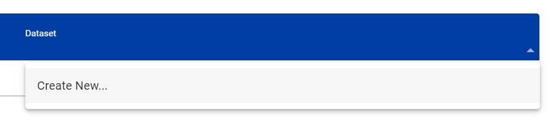

.. _setup:

Installation and configuration
==============================

This section summarizes the steps required to install a wis2box instance and setup your own datasets using initial configuration files 
provided by using the ``wis2box-create-config.py`` script.

Ensure you have Docker, Docker Compose and Python installed on your host, as detailed in :ref:`getting-started`.

Download
--------

Download the wis2box setup files from the `wis2box Releases`_ page.  Go to the latest release
and download the ``wis2box-setup-1.0b6.zip`` file from the Assets section.

.. code-block:: bash

   wget https://github.com/wmo-im/wis2box/releases/download/1.0b6/wis2box-setup-1.0b6.zip
   unzip wis2box-setup-1.0b6.zip
   cd wis2box-1.0b6

Create initial configuration files
----------------------------------

Run the following command to create the initial configuration files for your wis2box:

.. code-block:: bash

   python3 wis2box-create-config.py

.. note::

    The ``wis2box-create-config.py`` script will ask for a directory to store the configuration files. 
    Please provide the **absolute** path to the directory where you want to store the configuration files, for example ``/home/wis2box-user/wis2box-data``.
    This directory will be mapped to ``/data/wis2box`` **inside** the wis2box-management container.

   The script will also ask for the URL of your wis2box. Please provide the public URL of your wis2box, for example ``http://mywis2box.example.com``. 
   For testing purpose you can also provide the internal IP address you use to access the host, for example ``http://192.168.0.3`` and you change the URL in configuration files at a later point in time.

   The script will propose to automatically create passwords for ``WIS2BOX_STORAGE_PASSWORD`` and ``WIS2BOX_BROKER_PASSWORD``.
   These passwords are for internal use only within the wis2box, and it is recommended to accept the randomly generated passwords.

The script will have created a file "wis2box.env" with the configuration settings required to start your wis2box.

.. note::

   The wis2box.env was initialized with a default base-map URL and attribution.
   You can edit the environment variables in the ``wis2box.env`` file to customize the base-map URL and attribution.

Starting wis2box
----------------

Once you have prepared the necessary configuration files as described above you are ready to start the wis2box.

Run the following command to start wis2box:

.. code-block:: bash

   python3 wis2box-ctl.py start

This might take a while the first time, as Docker images will be downloaded.

.. note::

   The ``wis2box-ctl.py`` program is used as a convenience utility around a set of Docker Compose commands.
   You can customize the ports exposed on your host by editing ``docker-compose.override.yml``.
   
.. note::

   If you get the error:

   ``docker.errors.DockerException: Error while fetching server API version: ('Connection aborted.', PermissionError(13, 'Permission denied'))``

   Please ensure your username is added to the docker group ``sudo usermod -aG docker <your-username>``.
   Logout and log back in so that your group membership is re-evaluated.

Once the command above is completed, check that all services are running (and healthy).

.. code-block:: bash

   python3 wis2box-ctl.py status

Which should display the following:

.. code-block:: bash

            Name                       Command                  State                           Ports
   -----------------------------------------------------------------------------------------------------------------------
   cadvisor                 /usr/bin/cadvisor -logtostderr   Up (healthy)   8080/tcp
   elasticsearch            /bin/tini -- /usr/local/bi ...   Up (healthy)   9200/tcp, 9300/tcp
   grafana                  /run.sh                          Up             0.0.0.0:3000->3000/tcp
   loki                     /usr/bin/loki -config.file ...   Up             3100/tcp
   mosquitto                /docker-entrypoint.sh /usr ...   Up             0.0.0.0:1883->1883/tcp, 0.0.0.0:8884->8884/tcp
   mqtt_metrics_collector   python3 -u mqtt_metrics_co ...   Up             8000/tcp, 0.0.0.0:8001->8001/tcp
   nginx                    /docker-entrypoint.sh ngin ...   Up             0.0.0.0:80->80/tcp
   prometheus               /bin/prometheus --config.f ...   Up             9090/tcp
   wis2box                  /entrypoint.sh wis2box pub ...   Up
   wis2box-api              /app/docker/es-entrypoint.sh     Up
   wis2box-auth             /entrypoint.sh                   Up
   wis2box-minio            /usr/bin/docker-entrypoint ...   Up (healthy)   0.0.0.0:9000->9000/tcp, 0.0.0.0:9001->9001/tcp
   wis2box-ui               /docker-entrypoint.sh ngin ...   Up             0.0.0.0:9999->80/tcp

Refer to the :ref:`troubleshooting` section if this is not the case. 

You should now be able to view collections on the wis2box API by visiting the URL you specified during the configuration step,
 and adding ``/oapi/collections`` to the URL.	

.. image:: ../_static/wis2box-api-initial.png
  :width: 800
  :alt: Initial wis2box API collections list

The API will show one (initially empty) collection named 'Data Notifications'. 

This collection will be filled when you start ingesting data and publishing WIS2 notifications.

.. note::

   Additional collections will be added during the runtime configuration.

Runtime configuration
---------------------

Once wis2box is running you can prepare authentication tokens for updating your stations and running processes in the wis2box-webapp.

Login to the wis2box-management container

.. code-block:: bash

   python3 wis2box-ctl.py login

To create a token for running wis2box processes:

.. code-block:: bash

   wis2box auth add-token --path processes/wis2box

Record the token value displayed in a safe place, you will need it to run processes in the next section.

To create a token for updating stations:

.. code-block:: bash

   wis2box auth add-token --path collections/stations

Record the token value displayed in the output of the command above. You will use this token to update stations in the next section.

You can now logout of wis2box-management container:

.. code-block:: bash

   exit

Adding datasets
---------------

In order to publish data using the wis2box you need to create a dataset with discovery metadata and data mappings plugins.

Discovery metadata provides the data description needed for users to discover your data when searching the WIS2 Global Discovery Catalogue.

Data mappings plugins are used to transform the data from the input source format before the data is published.

You can use the wis2box-webapp to create datasets interactively: the dataset editor can be accessed by visiting the URL you specified during the configuration step,
and adding ``/wis2box-webapp/dataset_editor`` to the URL.

.. image:: ../_static/wis2box-webapp-dataset_editor.png
  :width: 800
  :alt: wis2box webapp dataset editor page

Please note that you need to add one dataset for each topic you want to publish data for. Please define your datasets before adding station metadata.

To start creating a new dataset select "Create new" from the dataset editor page:

A new popup will appear where you can define your "centre-id" and the type of dataset you want to create. 

.. note::

   Your centre-id should start with the ccTLD of your country, followed by a - and then the name of your organization, for example "fr-meteofrance".
   The centre-id has to be lowercase and use alphanumeric characters only.
   The dropdown list will show all currently registered centre-ids on WIS2.

There are 2 pre-defined dataset types for "weather/surface-based-observations/synop" and "weather/surface-based-observations/temp". 
We recommend using these pre-defined dataset types for published your "synop" and "temp" data, respectively. 
The predefined dataset will predefine the topic and data mappings for you.

If you want to create a dataset for a different topic, you can select "other" and define the topic and data mappings yourself.

Please select "Continue to form" to start defining your dataset:

.. image:: ../_static/wis2box-webapp-dataset_editor_continuetoform.png
  :width: 800
  :alt: wis2box webapp dataset editor page, continue to form

Make sure to provide a "description" for your dataset, review and add keywords and choose an appropriate bounding box.
You will also need to provide some contact information for the dataset.

Before publishing the new dataset make to click "Validate form" to check if all required fields are filled in:

.. image:: ../_static/wis2box-webapp-dataset_editor_validateform.png
  :width: 800
  :alt: wis2box webapp dataset editor page, validate form

Each dataset is associated with data-mappings plugins that transform the data from the input source format before the data is published.
If you are using the pre-defined dataset types for "synop" and "temp" data, the data mappings plugins will be pre-defined for you.
Otherwise, you will need to define the data mappings plugins for your dataset.

Finally, click "submit" to publish the dataset:

.. image:: ../_static/wis2box-webapp-dataset_editor_success.png
  :width: 800
  :alt: wis2box webapp dataset editor page, submit

.. note::

   You can also create datasets by defining MCF files in the ``metadata/discovery`` directory in your wis2box host directory and publish them from the CLI.
   For more information on publishing datasets using MCF files, see the reference documentation.

Adding station metadata
-----------------------

The next step is to add station metadata to your wis2box. This can be done interactively in the wis2box-webapp UI on the 'stations' page.

The station editor can be accessed by visiting the URL you specified during the configuration step, and adding ``/wis2box-webapp/station`` to the URL.

.. image:: ../_static/wis2box-webapp-stations.png
  :width: 800
  :alt: wis2box webapp stations page

Please note only data for stations that have been added to the wis2box will be ingested and result in WIS2 notifications being published.

Bulk inserting stations from CSV
--------------------------------

You can also bulk insert a set of stations from a CSV file, by defining the stations in ``metadata/stations/station_list.csv`` in your wis2box host directory and running the following command:

.. code-block:: bash

   python3 wis2box-ctl.py login
   wis2box metadata station publish-collection

After doing a bulk insert please review the stations in wis2box-webapp and associate each station to the correct topics.

Adding topics to stations from the command line
-----------------------------------------------

If you want to associate all stations in your station metadata to one topic, you can use the following command:

.. code-block:: bash

   python3 wis2box-ctl.py login
   wis2box metadata station add-topic <topic-id>

If you want to add a topic to a single station, you can use the following command:

.. code-block:: bash

   python3 wis2box-ctl.py login
   wis2box metadata station add-topic --wsi <station-id> <topic-id>

If you want to add a topic to all stations from a specific territory, for example Italy, you can use the following command:

.. code-block:: bash

   python3 wis2box-ctl.py login
   wis2box metadata station add-topic --territory-name Italy <topic-id>
   
The next is the :ref:`data-ingest`.

.. _`wis2box Releases`: https://github.com/wmo-im/wis2box/releases
.. _`WIS2 topic hierarchy`: https://github.com/wmo-im/wis2-topic-hierarchy
.. _`OSCAR`: https://oscar.wmo.int/surface
.. _`top level domain of your country`: https://en.wikipedia.org/wiki/Country_code_top-level_domain
