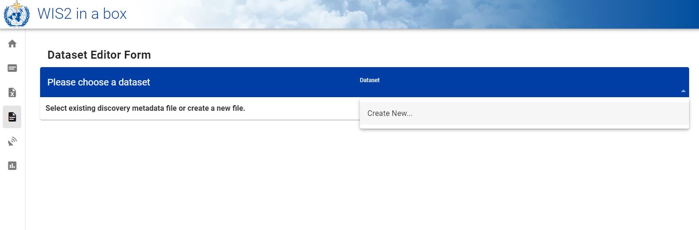
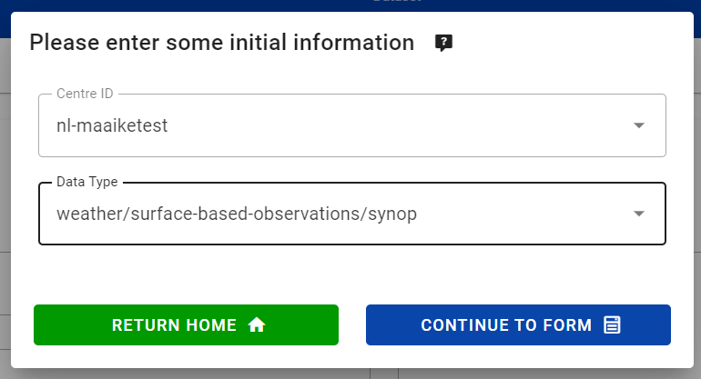
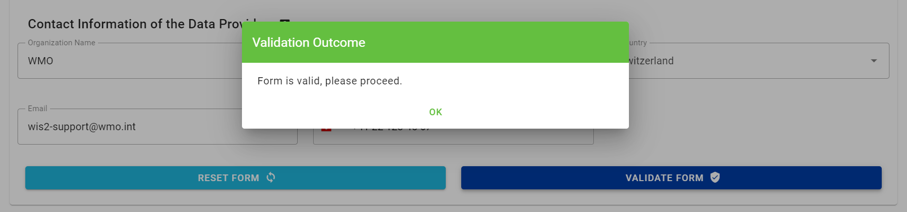
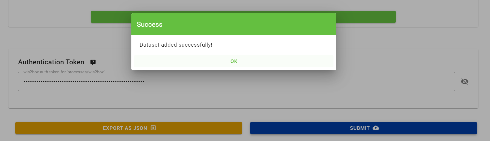
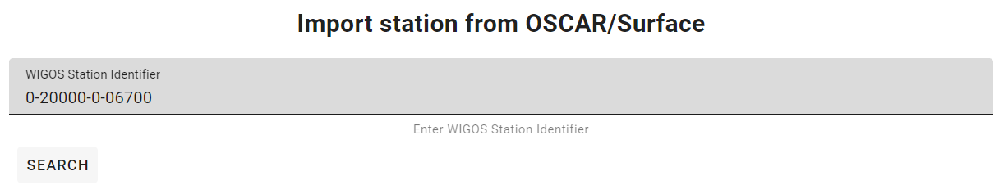
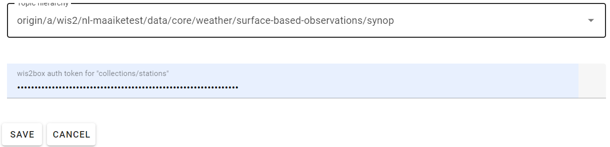

.. _setup:

Installation and configuration
==============================

This section summarizes the steps required to install a wis2box instance and setup your own datasets using initial configuration files
provided by using the ``wis2box-create-config.py`` script.

Ensure you have Docker, Docker Compose and Python installed on your host, as detailed in :ref:`getting-started`.

Download
--------

Download the wis2box setup files from the `wis2box Releases`_ page.  Go to the latest release
and download the .zip file from the Assets section.

.. code-block:: bash

   wget https://github.com/wmo-im/wis2box/releases/download/1.0b8/wis2box-setup-1.0b8.zip
   unzip wis2box-setup-1.0b8.zip
   cd wis2box-1.0b8

Create initial configuration files
----------------------------------

Run the following command to create the initial configuration files for your wis2box:

.. code-block:: bash

   python3 wis2box-create-config.py

.. note::

    The ``wis2box-create-config.py`` script will ask for a directory to store the configuration files.
    Please provide the **absolute** path to the directory where you want to store the configuration files, for example ``/home/wis2box-user/wis2box-data``.
    This directory will be mapped to ``/data/wis2box`` **inside** the wis2box-management container.

   The script will also ask for the URL of your wis2box. Please provide the public URL of your wis2box, for example ``http://mywis2box.example.com``.
   For testing purpose you can also provide the internal IP address you use to access the host, for example ``http://192.168.0.3`` and you change the URL in configuration files at a later point in time.

   The script will propose to automatically create a password for ``WIS2BOX_WEBAPP_PASSWORD``. This password is used to access the wis2box-webapp interface.

   The script will also propose to automatically create passwords for ``WIS2BOX_STORAGE_PASSWORD`` and ``WIS2BOX_BROKER_PASSWORD``.
   These passwords are for internal use only within the wis2box, and it is recommended to accept the randomly generated passwords.

The script will have created a file "wis2box.env" with the configuration settings required to start your wis2box.

.. note::

   You can edit the environment variables ``WIS2BOX_BASEMAP_URL`` and ``WIS2BOX_BASEMAP_ATTRIBUTION``
   in ``wis2box.env`` to customize the base-map URL and attribution that will be used in the wis2box frontends.

Starting wis2box
----------------

Once you have prepared the necessary configuration files as described above you are ready to start the wis2box.

Run the following command to start wis2box:

.. code-block:: bash

   python3 wis2box-ctl.py start

This might take a while the first time, as Docker images will be downloaded.

.. note::

   The ``wis2box-ctl.py`` program is used as a convenience utility around a set of Docker Compose commands.
   You can customize the ports exposed on your host by editing ``docker-compose.override.yml``.

.. note::

   In case you get errors from the Docker daemon stating 'Permission denied', such as:

   ``docker.errors.DockerException: Error while fetching server API version: ('Connection aborted.', PermissionError(13, 'Permission denied'))``

   Please ensure your username is added to the Docker group using the command:

   ``sudo usermod -aG docker <your-username>``.

   Logout and log back in so that your group membership is re-evaluated.

Once the command above is completed, check that all services are running (and healthy).

.. code-block:: bash

   python3 wis2box-ctl.py status

Check that all services are Up and not unhealthy:

.. code-block:: bash

            Name                       Command                  State                           Ports
   -----------------------------------------------------------------------------------------------------------------------
   elasticsearch            /bin/tini -- /usr/local/bi ...   Up (healthy)   9200/tcp, 9300/tcp
   grafana                  /run.sh                          Up             0.0.0.0:3000->3000/tcp
   loki                     /usr/bin/loki -config.file ...   Up             3100/tcp
   mosquitto                /docker-entrypoint.sh /usr ...   Up             0.0.0.0:1883->1883/tcp, 0.0.0.0:8884->8884/tcp
   mqtt_metrics_collector   python3 -u mqtt_metrics_co ...   Up             8000/tcp, 0.0.0.0:8001->8001/tcp
   nginx                    /docker-entrypoint.sh ngin ...   Up             0.0.0.0:80->80/tcp
   prometheus               /bin/prometheus --config.f ...   Up             9090/tcp
   wis2box                  /entrypoint.sh wis2box pub ...   Up
   wis2box-api              /app/docker/es-entrypoint.sh     Up
   wis2box-auth             /entrypoint.sh                   Up
   wis2box-minio            /usr/bin/docker-entrypoint ...   Up (healthy)   0.0.0.0:9000->9000/tcp, 0.0.0.0:9001->9001/tcp
   wis2box-ui               /docker-entrypoint.sh ngin ...   Up             0.0.0.0:9999->80/tcp
   wis2box-webapp           sh /wis2box-webapp/ ...          Up (healthy)   4173/tcp

Refer to the :ref:`troubleshooting` section if this is not the case.

Runtime configuration
---------------------

Once wis2box is running you can prepare authentication tokens for updating your stations and running processes in the wis2box-webapp.

Login to the wis2box-management container

.. code-block:: bash

   python3 wis2box-ctl.py login

To create a token for running wis2box processes:

.. code-block:: bash

   wis2box auth add-token --path processes/wis2box

Record the token value displayed in a safe place, you will need it to run processes in the next section.

To create a token for updating stations:

.. code-block:: bash

   wis2box auth add-token --path collections/stations

Record the token value displayed in the output of the command above. You will use this token to update stations in the next section.

You can now logout of wis2box-management container:

.. code-block:: bash

   exit

Accessing the wis2box-webapp
----------------------------

The following sections will explain how to create datasets and stations in your wis2box using the wis2box-webapp.

You can access the wis2box-webapp by visiting the URL you specified during the configuration step in your web browser and adding ``/wis2box-webapp`` to the URL.
For example, if you specified ``http://mywis2box.example.com`` as the URL, you can access the wis2box-webapp by visiting ``http://mywis2box.example.com/wis2box-webapp``.

The wis2box-webapp used basic authentication to control access to the webapp.  The default username is ``wis2box-user`` and the password is the value specified when running the script ``wis2box-create-config.py``.

The values of ``WIS2BOX_WEBAPP_USERNAME`` and ``WIS2BOX_WEBAPP_PASSWORD`` can be found in the ``wis2box.env`` file as follows:

.. code-block:: bash

   cat wis2box.env | grep WIS2BOX_WEBAPP

.. _adding-datasets:

Adding datasets
---------------

In order to publish data using the wis2box you need to create a dataset with discovery metadata and data mappings plugins. The metadata provides the data description needed for users to discover your data when searching the WIS2 Global Discovery Catalogue.
Data mappings plugins are used to transform the data from the input source format before the data is published.

You can use the wis2box-webapp to create datasets interactively using the dataset editor. Open the wis2box-webapp in your web browser and select the dataset editor from the menu on the left

You should see the following page:

To create a new dataset select "Create new" from the dataset editor page.

A popup will appear where you can define your "centre-id" and the type of dataset you want to create:

.. note::

   Your centre-id should start with the ccTLD of your country, followed by a - and an abbreviated name of your organization, for example ``fr-meteofrance``.
   The centre-id has to be lowercase and use alphanumeric characters only.
   The dropdown list shows all currently registered centre-ids on WIS2 as well as any centre-id you have already created in wis2box.

There are multiple predefined datasets, such as "weather/surface-based-observations/synop", "weather/surface-based-observations/temp", and "weather/advisories-warnings".
We recommend using these particular predefined dataset types to publish your "synop", "temp", and CAP alert data, respectively.
The predefined dataset will predefine the topic and data mappings for you.
If you want to create a dataset for a different topic, you can select "other" and define the topic and data mappings yourself.

Please select "Continue to form" to start defining your dataset.

Make sure to provide a "description" for your dataset, review and add keywords and choose an appropriate bounding box.
You will also need to provide some contact information for the dataset.

Before publishing the new dataset make to click "Validate form" to check if all required fields are filled in:

Each dataset is associated with data-mappings plugins that transform the data from the input source format before the data is published.
If you are using the predefined dataset types for "synop", "temp", or CAP alert data, the data mappings plugins will be predefined for you.
Otherwise, you will need to define the data mappings plugins for your dataset.

Finally, click "submit" to publish the dataset:

.. note::

   You can also create datasets by defining MCF files in the ``metadata/discovery`` directory in your wis2box host directory and publish them from the CLI.
   For more information on publishing datasets using MCF files, see the reference documentation.

Adding station metadata
-----------------------

The next step is to add station metadata to your wis2box. This can be done interactively using the wis2box-webapp or by bulk inserting stations from a CSV file.

Please note only data for stations that have been added to wis2box will be ingested and result in WIS2 notifications being published.

If you want to bulk insert station metadata from a CSV file, please refer to the `Bulk inserting stations from CSV`_ section.

The station editor can be accessed in the wis2box-webapp by selecting "Stations" from the menu on the left.

.. image:: ../_static/wis2box-webapp-stations.png
  :width: 800
  :alt: wis2box webapp stations page

Select "Create new" to start adding a new station.

You need to provide a WIGOS station identifier that will be used to import information about the station from OSCAR:

You can search for the station in OSCAR by providing the WIGOS station identifier and clicking "search".
If the station is found a new form will be displayed with the station information.
If the station is not found you have the option to fill the station form manually.

Check the form for any missing information.
You will need to select a WIS2 topic you would like to associate the station with.
The station editor will show you the available topics to choose from based on the datasets you have created.
If you don't see the topic you want to associate the station with, you need to create a dataset for that topic first.

To store the station metadata  click "save" and provide the 'collections/stations' token you created in the previous section:

Bulk inserting stations from CSV
--------------------------------

You can also bulk insert a set of stations from a CSV file, by defining the stations in ``mystations.csv`` in your wis2box host directory and running the following command:

.. code-block:: bash

   python3 wis2box-ctl.py login
   wis2box metadata station publish-collection --path /data/wis2box/mystations.csv --topic-hierarchy origin/a/wis2/mw-mw_met_centre-test/data/core/weather/surface-based-observations/synop

.. note::

   The ``path`` argument refers to the path of the CSV file within the wis2box-management container.
   The directory defined by WIS2BOX_HOST_DATADIR is mounted as /data/wis2box in the wis2box-management container.

   The ``topic-hierarchy`` argument refers to the WIS2 topic hierarchy you want to associate the stations with.

After doing a bulk insert please review the stations in wis2box-webapp to ensure the stations were imported correctly.

Next steps
----------

The next step is to prepare data ingestion into wis2box, see :ref:`data-ingest`.

.. _`wis2box Releases`: https://github.com/wmo-im/wis2box/releases
.. _`WIS2 topic hierarchy`: https://github.com/wmo-im/wis2-topic-hierarchy
.. _`OSCAR`: https://oscar.wmo.int/surface
.. _`top level domain of your country`: https://en.wikipedia.org/wiki/Country_code_top-level_domain
