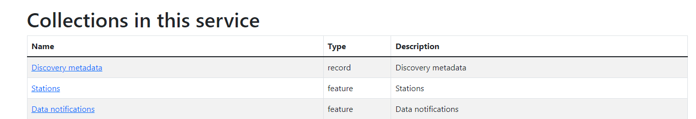
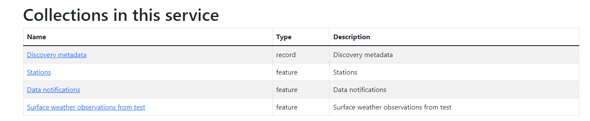
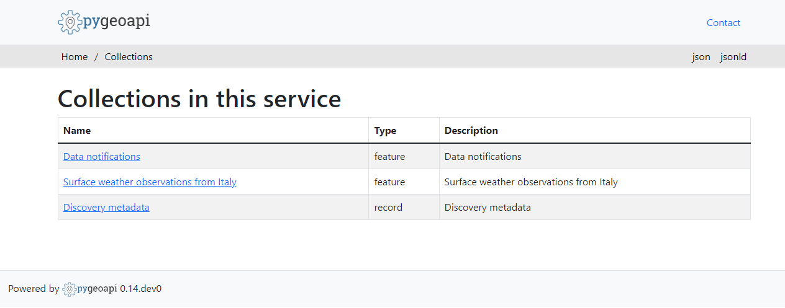

.. _setup:

Installation and configuration
==============================

This section summarizes the steps required to install a wis2box instance and setup your own datasets using example configurations.

Ensure you have Docker, Docker Compose and Python installed on your host, as detailed in :ref:`getting-started`.

Download
--------

Download the wis2box setup files from the `wis2box Releases`_ page.  Go to the latest release
and download the ``wis2box-setup-1.0b4.zip`` file from the Assets section.

.. code-block:: bash

   wget https://github.com/wmo-im/wis2box/releases/download/1.0b4/wis2box-setup-1.0b4.zip
   unzip wis2box-setup-1.0b4.zip
   cd wis2box-1.0b4

Environment variables
---------------------

wis2box uses environment variables from ``dev.env`` to its containers on startup.
An example file is provided in ``examples/config/wis2box.extended.env``. 
Copy this file to your working directory, and update it to suit your needs.

.. code-block:: bash

   cp examples/config/wis2box.env dev.env

.. note::
   Please ensure you set ``WIS2BOX_BROKER_PASSWORD`` and ``WIS2BOX_STORAGE_PASSWORD`` to your own unique values.
   
   You will use these passwords to connect to your broker and MinIO storage to help you debug your wis2box services.
   
   Do not share these passwords with external parties.

.. note::

   You must map ``WIS2BOX_HOST_DATADIR`` to the absolute path of a directory on your host machine. This path will be mapped to ``/data/wis2box`` inside the **wis2box-management** container.
   To enable external data sharing you must set ``WIS2BOX_URL`` to the URL pointing to where your host is exposed on the public network.

For example you can create a ``wis2box-data`` directory in your home directory as follows:

.. code-block:: bash

   mkdir /home/<your-username>/wis2box-data

And you can edit ``dev.env`` to match the location

.. code-block:: bash

   WIS2BOX_HOST_DATADIR=/home/<your-username>/wis2box-data

Data mappings
-------------

wis2box configuration requires a data mappings file, which defines the plugins used to process your data.
Example mapping files are included in the release archive:

* ``synop-bufr-mappings.yml``, input is binary data (BUFR) defined by a ``.bufr`` extension
* ``synop-csv-mappings.yml``, input is comma-separated-values defined by a ``.csv`` extension
* ``synop-synop-mappings.yml``, input is SYNOP defined with a ``.txt`` extension

For example, if your incoming data contains ``.bufr4`` files containing synoptic observations, you can copy the following example:

.. code-block:: bash

   cp examples/config/synop-bufr-mappings.yml ~/wis2box-data/data-mappings.yml

.. note::

   The file should be called ``data-mappings.yml`` and should be placed in the directory you defined as ``WIS2BOX_HOST_DATADIR``.

Edit ``~/wis2box-data/data-mappings.yml``:
 
 * Replace ``country`` with your corresponding ISO 3166 alpha-3 country code in lowercase
 * Replace ``centre_id`` with the string identifying the centre running your wis2node in lowercase, alphanumeric characters

If you need to define multiple datasets, you can add multiple entries in your ``data-mappings.yml``. For example:

.. code-block:: bash

   data:
      ita.italy_wmo_demo.data.core.weather.surface-based-observations.synop:
        plugins:
            bufr:
                - plugin: wis2box.data.bufr4.ObservationDataBUFR
                  notify: true
                  buckets:
                    - ${WIS2BOX_STORAGE_INCOMING}
                  file-pattern: '*'
            bufr4:
                - plugin: wis2box.data.bufr2geojson.ObservationDataBUFR2GeoJSON
                  buckets:
                    - ${WIS2BOX_STORAGE_PUBLIC}
                  file-pattern: '^WIGOS_(\d-\d+-\d+-\w+)_.*\.bufr4$'
      ita.italy_wmo_demo.data.core.weather.surface-based-observations.temp:
        plugins:
            bufr:
                - plugin: wis2box.data.bufr4.ObservationDataBUFR
                  notify: true
                  buckets:
                    - ${WIS2BOX_STORAGE_INCOMING}
                  file-pattern: '*'
            bufr4:
                - plugin: wis2box.data.bufr2geojson.ObservationDataBUFR2GeoJSON
                  buckets:
                    - ${WIS2BOX_STORAGE_PUBLIC}
                  file-pattern: '^WIGOS_(\d-\d+-\d+-\w+)_.*\.bufr4$'
      
In this case the data mappings configuration has specified 2 datasets (SYNOP, and TEMP).

You can also combine input for the same dataset provided in different formats.
For example, if you would like to process input data that is provided both as SYNOP and binary data:

.. code-block:: bash

   data:
      ita.italy_wmo_demo.data.core.weather.surface-based-observations.synop:
        plugins:
            bufr:
                - plugin: wis2box.data.bufr4.ObservationDataBUFR
                  notify: true
                  buckets:
                    - ${WIS2BOX_STORAGE_INCOMING}
                  file-pattern: '*'
            csv:
                - plugin: wis2box.data.csv2bufr.ObservationDataCSV2BUFR
                  template: synop_bufr.json
                  notify: true
                  file-pattern: '*'
            bufr4:
                - plugin: wis2box.data.bufr2geojson.ObservationDataBUFR2GeoJSON
                  buckets:
                    - ${WIS2BOX_STORAGE_PUBLIC}
                  file-pattern: '^WIGOS_(\d-\d+-\d+-\w+)_.*\.bufr4$'

.. note::

   The dataset identifier is used to define the topic hierarchy for your data (see `WIS2 topic hierarchy`_).  The top 3 levels of the WIS2 topic hierarchy (``origin/a/wis2``) are automatically included by wis2box when publishing your data.
    
   * dataset: ita.italy_wmo_demo.data.core.weather.surface-based-observations.synop
   * topic-hierarchy: origin/a/wis2/ita/italy_wmo_demo/data/core/weather/surface-based-observations/synop

.. note::
   
   In these examples, files in the ``wis2box-incoming`` storage bucket are processed to produce ``.bufr4`` stored in the ``wis2box-public`` storage bucket, using either the ``bufr4.ObservationDataBUFR`` or the ``wis2box.data.csv2bufr.ObservationDataCSV2BUFR`` plugins.

   Files in the ``wis2box-public`` storage bucket are converted to GeoJSON and stored in the wis2box API backend using the ``wis2box.data.bufr2geojson.ObservationDataBUFR2GeoJSON`` plugin.

   You can provide your own plugins as needed; for more information (see :ref:`extending-wis2box`).

Station metadata list
---------------------

wis2box requires information about the stations for which you will be sharing data.

An example of the configuration file for the stations is provided in ``station_list.csv``. 

You can copy this file to ``metadata/station/station_list.csv`` in your $WIS2BOX_HOST_DATADIR:

.. code-block:: bash

   mkdir -p ~/wis2box-data/metadata/station
   cp examples/config/station_list.csv ~/wis2box-data/metadata/station

And edit ``~/wis2box-data/metadata/station/station_list.csv`` to include the data for your stations.

.. note::

   The ``station_list.csv`` requires column names ``station_name`` and the ``wigos_station_identifier`` (WSI) with which the station is registered in `OSCAR`_.  Optionally, you can provide a ``traditional_station_identifier (TSI)`` column.
   The TSI can be left empty if your data contains a WSI. If your data contains a TSI but no WSI, the ``station_list.csv`` will be used to derive the corresponding WSI for that station.

To verify station metadata from OSCAR/Surface, run the following command:

.. code-block:: bash

   wis2box metadata station get <WSI>

Then to add to the station list:

.. code-block:: bash

   wis2box metadata station get <WSI> >> ~/wis2box-data/metadata/station/station_list.csv

Discovery metadata
------------------

Discovery metadata provides the data description needed for users to discover your data when searching the WIS2 Global Discovery Catalogue.

Updated discovery metadata records are shared globally through the MQTT endpoint defined in your wis2box.

Discovery metadata records can be defined using the YAML syntax shared via ``WIS2BOX_HOST_DATADIR``.

An example is provided in ``surface-weather-observations.yml``. Each dataset requires its own discovery metadata configuration file.

You can copy the file ``surface-weather-observations.yml`` to the directory defined for ``WIS2BOX_HOST_DATADIR``:

.. code-block:: bash

   cp examples/config/surface-weather-observations.yml ~/wis2box-data/metadata/station

And update it to provide the correct discovery metadata for your dataset:

* replace ``[country].[centre_id].data.core.weather.surface-based-observations.synop`` with the topic as previously used in ``$WIS2BOX_HOST_DATADIR/data-mappings.yml``
* text provided in ``identification.title`` and ``identification.abstract`` will be displayed in the wis2box user interface
* provide a valid geographic bounding box in ``identification.extents.spatial.bbox``

Starting wis2box
----------------

Once you have prepared the necessary configuration files as described above you are ready to start the wis2box.

Run the following command to start wis2box:

.. code-block:: bash

   python3 wis2box-ctl.py start

This might take a while the first time, as Docker images will be downloaded.

.. note::

   The ``wis2box-ctl.py`` program is used as a convenience utility around a set of Docker Compose commands.
   You can customize the ports exposed on your host by editing ``docker-compose.override.yml``.
   
.. note::

   If you get the error:

   ``docker.errors.DockerException: Error while fetching server API version: ('Connection aborted.', PermissionError(13, 'Permission denied'))``

   Please ensure your username is added to the docker group ``sudo usermod -aG docker <your-username>``.
   Logout and log back in so that your group membership is re-evaluated.

Once the command above is completed, check that all services are running (and healthy).

.. code-block:: bash

   python3 wis2box-ctl.py status

Which should display the following:

.. code-block:: bash

            Name                       Command                  State                           Ports
   -----------------------------------------------------------------------------------------------------------------------
   cadvisor                 /usr/bin/cadvisor -logtostderr   Up (healthy)   8080/tcp
   elasticsearch            /bin/tini -- /usr/local/bi ...   Up (healthy)   9200/tcp, 9300/tcp
   grafana                  /run.sh                          Up             0.0.0.0:3000->3000/tcp
   loki                     /usr/bin/loki -config.file ...   Up             3100/tcp
   mosquitto                /docker-entrypoint.sh /usr ...   Up             0.0.0.0:1883->1883/tcp, 0.0.0.0:8884->8884/tcp
   mqtt_metrics_collector   python3 -u mqtt_metrics_co ...   Up             8000/tcp, 0.0.0.0:8001->8001/tcp
   nginx                    /docker-entrypoint.sh ngin ...   Up             0.0.0.0:80->80/tcp
   prometheus               /bin/prometheus --config.f ...   Up             9090/tcp
   wis2box                  /entrypoint.sh wis2box pub ...   Up
   wis2box-api              /app/docker/es-entrypoint.sh     Up
   wis2box-auth             /entrypoint.sh                   Up
   wis2box-minio            /usr/bin/docker-entrypoint ...   Up (healthy)   0.0.0.0:9000->9000/tcp, 0.0.0.0:9001->9001/tcp
   wis2box-ui               /docker-entrypoint.sh ngin ...   Up             0.0.0.0:9999->80/tcp

Refer to the :ref:`troubleshooting` section if this is not the case. 

You should now be able to view collections on the wis2box API by visiting ``http://localhost/oapi/collections`` in a web browser, which should appear as follows:

The API will show one (initially empty) collection 'Data Notifications'. 
This collection will be filled when you start ingesting data and publishing WIS2 notifications.

.. note::

   Additional collections will be added during the runtime configuration.

Runtime configuration
---------------------

The following last design time steps are then required once wis2box is running.

Login to the wis2box-management container

.. code-block:: bash

   python3 wis2box-ctl.py login

.. note::

   ``$WIS2BOX_DATADIR`` is the location that ``$WIS2BOX_HOST_DATADIR`` binds to **inside** the container. 
   This allows wis2box to access the configuration files from **inside** the wis2box-management container.
   By default, ``WIS2BOX_DATADIR`` points to ``/data/wis2box`` **inside** the wis2box-management container.

The first step is add the new dataset as defined by the YAML file for your discovery metadata record defined previously, using the following command:

.. code-block:: bash

   wis2box data add-collection ${WIS2BOX_DATADIR}/surface-weather-observations.yml

.. note::

   If you see an error like ``ValueError: No plugins for XXX defined in data mappings``, exit the wis2box-container and edit the ``data-mappings.yml`` file in the directory defined by ``WIS2BOX_HOST_DATADIR``

You can view the collection you just added, by re-visiting ``http://localhost/oapi/collections`` in a web browser.

The second step is to publish discovery metadata and cache its content in the wis2box API:

.. code-block:: bash

   wis2box metadata discovery publish ${WIS2BOX_DATADIR}/surface-weather-observations.yml

This command publishes an MQTT message with information about your dataset to the WIS2 Global Discovery Catalogue. Repeat this command whenever you have to provide updated metadata about your dataset.

You can review the discovery metadata just cached through the new link in  ``http://localhost/oapi/collections``:

The final step is to publish your station information to the wis2box API from the station metadata list you prepared:

.. code-block:: bash

   wis2box metadata station publish-collection

You can review the stations you just cached through the new link in  ``http://localhost/oapi/collections``:

.. image:: ../_static/wis2box-api-stations.png
  :width: 800
  :alt: wis2box API collections list with added stations

You can now logout of wis2box-management container:

.. code-block:: bash

   exit

The next is the :ref:`data-ingest`.

.. _`wis2box Releases`: https://github.com/wmo-im/wis2box/releases
.. _`WIS2 topic hierarchy`: https://github.com/wmo-im/wis2-topic-hierarchy
.. _`OSCAR`: https://oscar.wmo.int/surface
