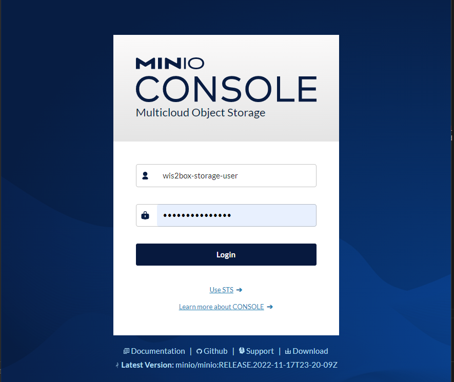
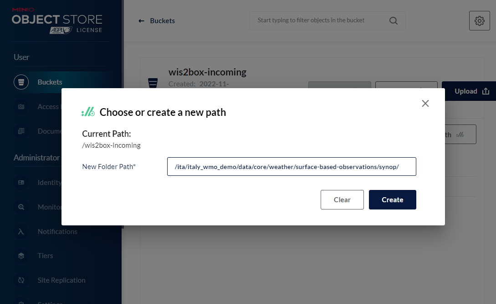
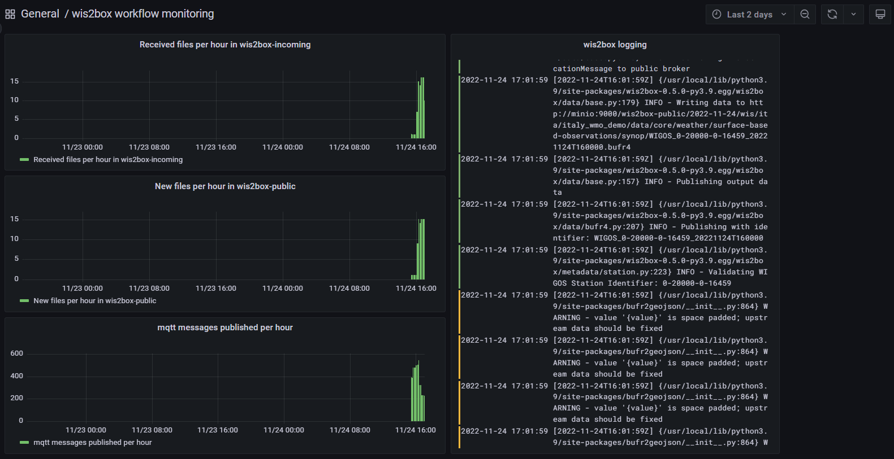

.. _data-ingestion:

Setting up ingestion
====================

The runtime component of wis2box is data ingestion. This is an event driven workflow driven by S3 notifications from uploading data to wis2box-storage.

The wis2box-storage is provided using a `MinIO`_-container that provides S3-compatible object storage.

Any file received in the 'wis2box-incoming'-bucket will trigger an action to process the file. 

MinIO UI
--------

To access the MinIO UI, visit http://localhost:9001 in your web browser.

You can login with your WIS2BOX_STORAGE_USERNAME and WIS2BOX_STORAGE_PASSWORD:

To test the data ingestion, please insert a sample-file for your observations in the 'wis2box-incoming'-bucket.

Select 'browse' on the 'wis2box-incoming'-bucket and select 'create new path' to define a New Folder Path:

.. note::
    The folder in which the file is placed defines the dataset for the data you are sharing: for dataset='foo.bar', store your file in the path '/foo/bar/'. 
    
    The path is also used to define the topic-hierarchy for your data, see `WIS2-topic-hierarchy`_. The first 3 levels of the WIS2-topic-hierarchy 'origin/a/wis2' are automatically included by wis2box when publishing messages.

    *'Topic Hierarchy validation error: No plugins for minio:9000/wis2box-incoming/... in data mappings'* indicates you stored a file in a folder for which no matching dataset was defined in your data-mappings.yml. 

After uploading a file to 'wis2box-incoming', you can browse the content in the 'wis2box-public'-bucket, if data ingestion was successful, new data will appear here:

.. image:: screenshots/minio_wis2box_public.png
    :width: 800
    :alt: minio-wis2box-public

In case no data appears in the wis2box-public bucket, you can view the logs from the command-line :

.. code-block:: bash

   python3 wis2box-ctl.py logs wis2box

Or by visiting the local Grafana-instance running at http://localhost:3000

wis2box workflow monitoring
---------------------------

The Grafana homepage shows an overview with the number files received, new files produced and messages published.
Pay attention to the messages reported in the wis2box-logs on the right-hand side which indicate if something is going wrong during the data-processing:

Once you have verified that the ingest is working correctly you can prepare an automated workflow to send your data into the wis2box.

Automating data ingestion
-------------------------

See below an example to upload data using the Minio-module in python:

.. code-block:: python

    import glob
    import sys

    from minio import Minio

    filepath = '/home/wis2box-user/local-data/mydata.bin'
    minio_path = '/ita/italy_wmo_demo/data/core/weather/surface-based-observations/synop/'

    endpoint = 'http://localhost:9000'
    WIS2BOX_STORAGE_USERNAME = 'wis2box-storage-user'
    WIS2BOX_STORAGE_PASSWORD = '<your-unique-password>'

    client = Minio(
        endpoint=endpoint,
        access_key=WIS2BOX_STORAGE_USERNAME,
        secret_key=WIS2BOX_STORAGE_PASSWORD,
        secure=is_secure=False)
    
    filename = filepath.split('/')[-1]
    client.fput_object('wis2box-incoming', minio_path+filename, filepath)

Another example is provided in the GitHub-repository `minio-ftp-forwarder`_ , demonstrating how to setup an FTP forwarding data to MinIO

After you have successfully setup your data-ingestion process into the wis2box, 
you are ready to share your data with the Global WIS2 network by enabling external access to your public services: :ref:`public-services`.

.. _`MinIO`: https://min.io/docs/minio/container/index.html
.. _`minio-ftp-forwarder`: https://github.com/wmo-im/minio-ftp-forwarder
.. _`wis2-topic-hierarchy`: https://github.com/wmo-im/wis2-topic-hierarchy